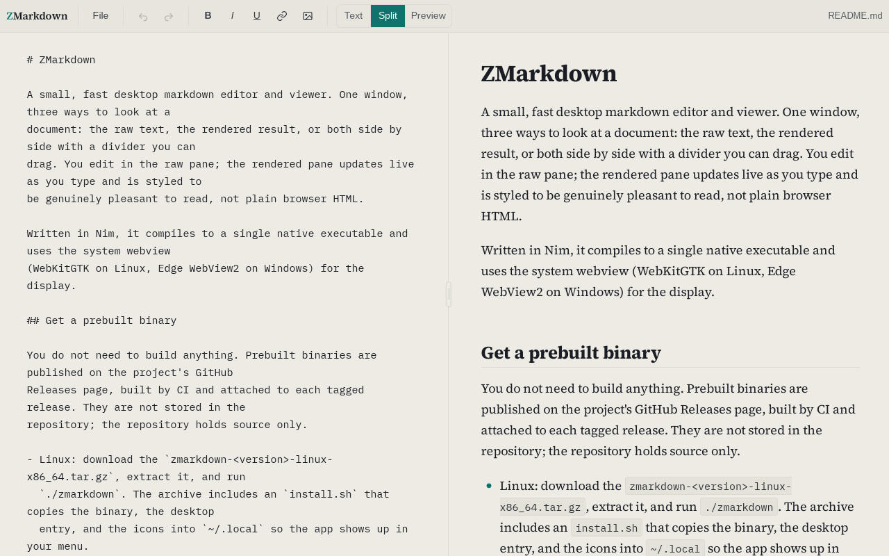
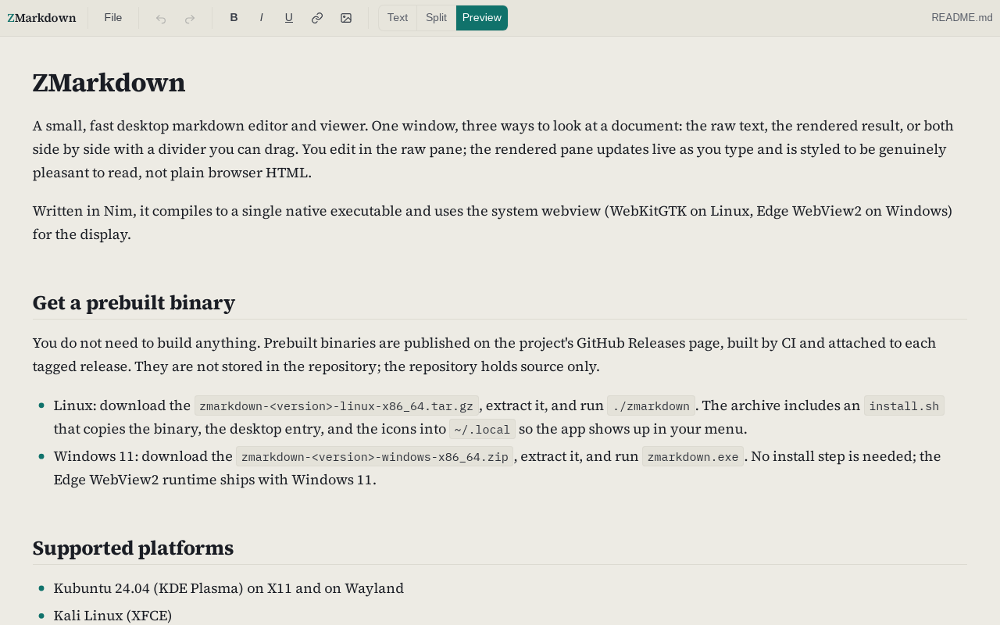
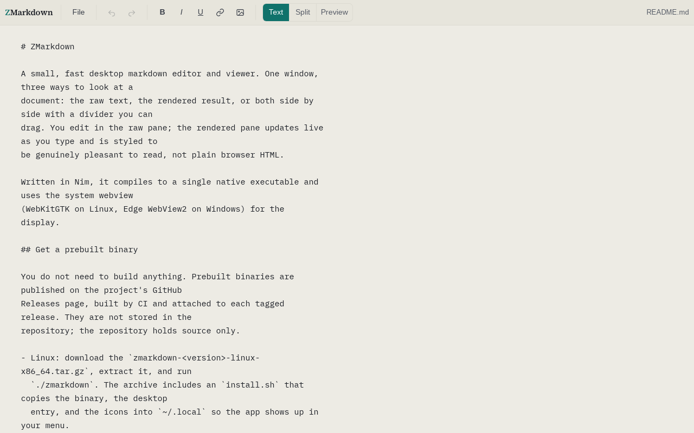

# ZMarkdown

A small, fast desktop markdown editor and viewer. One window, three ways to look at a
document: the raw text, the rendered result, or both side by side with a divider you can
drag. You edit in the raw pane; the rendered pane updates live as you type and is styled to
be genuinely pleasant to read, not plain browser HTML.

Written in Nim, it compiles to a single native executable and uses the system webview
(WebKitGTK on Linux, Edge WebView2 on Windows) for the display.

## Screenshots

Split view: the raw markdown on the left, the live rendered result on the right, with a
divider you can drag all the way to either edge.



Preview only: the rendered reading view.



Text only: a plain markdown editor.



## Get a prebuilt binary

You do not need to build anything. Prebuilt binaries are published on the project's GitHub
Releases page, built by CI and attached to each tagged release. They are not stored in the
repository; the repository holds source only.

- Linux: download the `zmarkdown-<version>-linux-x86_64.tar.gz`, extract it, and run
  `./zmarkdown`. The archive includes an `install.sh` that copies the binary, the desktop
  entry, and the icons into `~/.local` so the app shows up in your menu.
- Windows 11: download the `zmarkdown-<version>-windows-x86_64.zip`, extract it, and run
  `zmarkdown.exe`. No install step is needed; the Edge WebView2 runtime ships with
  Windows 11.

## Supported platforms

- Kubuntu 24.04 (KDE Plasma) on X11 and on Wayland
- Kali Linux (XFCE)
- Windows 11

Other platforms may work but are not supported.

## Runtime requirements (Linux)

The Linux binary links the system GTK3 and WebKitGTK 4.1 libraries, which the desktops
above already ship. It also needs a native dialog helper for open/save and confirmation
prompts: KDE provides `kdialog`; on other desktops install `zenity` (`make deps` installs
it). The regex library the markdown renderer uses (PCRE) is compiled into the binary, so
nothing else is needed at runtime. On Windows there is no extra runtime dependency.

## Build from source

Everything goes through the `Makefile`. Run `make` on its own to see every target.

```
make deps    # install the toolchain and libraries (uses sudo for system packages on Linux)
make run     # build and launch the app
make test    # run the unit tests and the headless end-to-end smoke test
make build   # just build the release binary into build/
make install # install into ~/.local: binary on your PATH, plus menu entry and icons (Linux)
make dist    # build and package the Linux tarball
```

`make install` puts the binary in `~/.local/bin` (make sure that's on your `PATH`) and adds
the desktop entry and icons so it appears in your application menu. Override the location
with `make install PREFIX=/usr/local`, and `make uninstall` removes it again.

`make deps` prints exactly what it is about to do before it does it. On Linux it first
checks which of these system packages are already installed and only uses `sudo apt-get`
for the ones that are missing, showing that list and the exact root commands before asking
for your password. If they are all already present, it does not ask for sudo at all.

| Package | Why |
| --- | --- |
| `build-essential` | C/C++ toolchain (Nim compiles through a C++ backend) |
| `pkg-config` | finds the GTK and WebKit build and link flags |
| `libgtk-3-dev` | GTK 3, the toolkit the Linux webview is built on |
| `libwebkit2gtk-4.1-dev` | WebKitGTK 4.1, renders the markdown preview |
| `zenity` | native file dialog fallback (KDE already ships kdialog) |
| `xvfb` | virtual display, used only by `make test` |
| `ca-certificates`, `curl` | fetch the Nim toolchain over HTTPS |

It then installs the Nim toolchain per-user via choosenim if it is missing (no sudo) and
fetches the pinned Nim dependencies (`markdown`, `tinyfiledialogs`) into `~/.nimble`. On
Windows, run the dependency bootstrap directly (per-user, no administrator rights needed;
the Edge WebView2 runtime is already present on Windows 11):

```
powershell -ExecutionPolicy Bypass -File scripts\deps-windows.ps1
```

then build from Git Bash (the MinGW compiler Nim uses must be on `PATH`; the first
command compiles the bundled regex library — see "Bundled PCRE" below):

```
bash scripts/build-pcre.sh
nim cpp -d:release --hints:off -o:build/zmarkdown.exe src/zmarkdown.nim
```

### The Microsoft WebView2 SDK is fetched, not bundled

The Windows build compiles against the Microsoft WebView2 SDK headers. Those headers are
**not** stored in this repository. The WebView2 SDK is Microsoft's and comes under
Microsoft's own license terms, separate from this project, so rather than redistribute it
here we download it from Microsoft's official NuGet package at build time. This keeps the
repository's own licensing clean and avoids shipping files whose redistribution terms would
have to be vetted separately.

The Windows dependency bootstrap (`scripts\deps-windows.ps1`) and the CI build both run
`scripts\fetch-webview2.ps1`, which downloads the SDK and places its headers in
`src/vendor/webview/libs/webview2/` (a git-ignored folder). Set `WEBVIEW2_SDK_VERSION` to
pin a specific SDK version; otherwise the latest stable release is used. The Linux build
does not use any of this; it uses WebKitGTK.

### Bundled PCRE (compiled in, no runtime dependency)

The markdown renderer's regex engine uses the classic PCRE library. That library's final
release (8.45) is end-of-life upstream, and current Linux distributions have removed its
package from their archives, so it cannot be relied on — or even installed — at runtime.
Instead, its source tarball (BSD licensed; notice reproduced under "License" below) is
vendored at `src/vendor/pcre/pcre-8.45.tar.gz`, verified against its SHA-256, and compiled
into a static library by `scripts/build-pcre.sh` (`make build` runs it automatically). The
result is linked directly into the executable on both Linux and Windows, so the finished
binary needs no PCRE package, no `libpcre.so.3`, and no `pcre64.dll` anywhere.

## Using it

- **View modes.** Three toolbar buttons switch between **Text**, **Split**, and **Preview**.
  In Split, drag the divider all the way to either edge to give one pane the whole window;
  clicking any of the three buttons recenters the divider.
- **Formatting shortcuts** in the raw editor:
  - **Ctrl+B** bold, **Ctrl+I** italic, **Ctrl+U** underline. With text selected they wrap
    the selection; with nothing selected they insert the markers and put the caret between
    them.
  - The link and image toolbar buttons insert sample markdown you can edit in place.
- **Undo / redo** with the toolbar buttons or **Ctrl+Z** and **Ctrl+Y** (**Ctrl+Shift+Z**
  also redoes). History is bounded by memory (about 100 MB), not by a step count: only when
  that is exceeded are the oldest edits dropped.
- **Files.** **Ctrl+N** new, **Ctrl+O** open, **Ctrl+S** save, **Ctrl+Shift+S** save as. The
  File menu has the same actions plus Settings and Exit. If you have unsaved changes when
  starting a new document, opening a file, or exiting, a prompt lets you save, discard, or
  cancel.
- **Drag and drop.** Drop a markdown file onto the window to open it. Setting ZMarkdown as
  the handler for markdown files also lets you open them by double-clicking in your file
  manager.
- **Middle-click autoscroll.** Middle-click in the rendered pane to start drag-to-scroll,
  like a web browser: a round marker follows the cursor and the pane scrolls by how far you
  move from the click point. Click again, press a key, or use the wheel to stop.
- **Settings.** File > Settings sets the font, font color, and background color, applied to
  both panes; your choices persist between runs.
- **Virtual machines and machines without 3D acceleration** (Linux). At startup the app
  checks whether the display has working 3D acceleration. Where it does not — a VM without
  guest 3D is the common case — the preview engine is told to render on the CPU instead of
  stalling for seconds on the missing GPU. The verdict is cached and quietly re-checked in
  the background each launch, so enabling 3D in your VM later is picked up on the next run.
  To override the detection, pass `--no-gpu` or `--gpu` on the command line, or set
  `ZMARKDOWN_NO_GPU=1` in the environment.

The editor stays plain markdown text at all times; the shortcuts only insert or wrap
markdown syntax, they never style the text in the editor itself.

## Configuration

The app remembers a little state between runs, stored as JSON:

- Linux: `~/.config/zmarkdown/state.json` (or `$XDG_CONFIG_HOME/zmarkdown/state.json`)
- Windows: `%APPDATA%\ZMarkdown\state.json`

It restores the window size and whether the window was maximized (the size is clamped to
your current screen and never below a usable minimum), the view mode, the divider
position, your File > Settings choices, and the cached graphics verdict described under
"Using it". It does not reopen your previous file: every launch starts with a fresh, empty
document. The app follows your system light or dark
preference automatically. If the state file is missing or unreadable, the app starts with
sensible defaults; if the config directory cannot be written, it simply skips saving state.

## Known limitations

- The app targets Windows 11, where the Edge WebView2 runtime is always present. Earlier
  Windows versions are not supported.
- On Linux the window and taskbar icon rely on your desktop reading the installed desktop
  entry and icons (which `install.sh` sets up) and matching the application's window class.
- Native dialogs require `kdialog` or `zenity` to be installed. Without either, open, save,
  and confirmation dialogs cannot be shown; the app logs this and keeps running rather than
  failing, but those actions will not work until you install one of them.
- The markdown renderer supports CommonMark plus GitHub tables and strikethrough. Task
  lists and bare-URL autolinking are not rendered.
- The app renders your own local document and intentionally lets raw HTML in the markdown
  pass through (this is how the underline shortcut works). It does not sanitize HTML.

## See also

ZMarkdown is written in [Nim](https://nim-lang.org), a statically typed, compiled language
with a readable Python-like syntax that produces small, dependency-light native binaries.
It is not as widely known as it deserves to be; if you are curious, these are good starting
points:

- Website and downloads: [nim-lang.org](https://nim-lang.org)
- Learn Nim (tutorials and guides): [nim-lang.org/learn.html](https://nim-lang.org/learn.html)
- Documentation and standard library: [nim-lang.org/documentation.html](https://nim-lang.org/documentation.html)
- Community forum: [forum.nim-lang.org](https://forum.nim-lang.org)
- Source code: [github.com/nim-lang/Nim](https://github.com/nim-lang/Nim)

## License

ZMarkdown's own code is under the MIT License; the full text is in the `LICENSE` file at
the repository root. It builds on the third-party components below, which keep their own
licenses. Their notices are reproduced here in full.

### webview (C/C++ library, used for the Linux and Windows UI)

```
MIT License

Copyright (c) 2017 Serge Zaitsev
Copyright (c) 2022 Steffen André Langnes

Permission is hereby granted, free of charge, to any person obtaining a copy
of this software and associated documentation files (the "Software"), to deal
in the Software without restriction, including without limitation the rights
to use, copy, modify, merge, publish, distribute, sublicense, and/or sell
copies of the Software, and to permit persons to whom the Software is
furnished to do so, subject to the following conditions:

The above copyright notice and this permission notice shall be included in all
copies or substantial portions of the Software.

THE SOFTWARE IS PROVIDED "AS IS", WITHOUT WARRANTY OF ANY KIND, EXPRESS OR
IMPLIED, INCLUDING BUT NOT LIMITED TO THE WARRANTIES OF MERCHANTABILITY,
FITNESS FOR A PARTICULAR PURPOSE AND NONINFRINGEMENT. IN NO EVENT SHALL THE
AUTHORS OR COPYRIGHT HOLDERS BE LIABLE FOR ANY CLAIM, DAMAGES OR OTHER
LIABILITY, WHETHER IN AN ACTION OF CONTRACT, TORT OR OTHERWISE, ARISING FROM,
OUT OF OR IN CONNECTION WITH THE SOFTWARE OR THE USE OR OTHER DEALINGS IN THE
SOFTWARE.
```

### neroist/webview (Nim binding, vendored under `src/vendor/webview/`)

```
Copyright 2023 neroist

Permission is hereby granted, free of charge, to any person obtaining a copy of
this software and associated documentation files (the "Software"), to deal in the
Software without restriction, including without limitation the rights to use, copy,
modify, merge, publish, distribute, sublicense, and/or sell copies of the Software,
and to permit persons to whom the Software is furnished to do so, subject to the
following conditions:

The above copyright notice and this permission notice shall be included in all
copies or substantial portions of the Software.

THE SOFTWARE IS PROVIDED "AS IS", WITHOUT WARRANTY OF ANY KIND, EXPRESS OR IMPLIED,
INCLUDING BUT NOT LIMITED TO THE WARRANTIES OF MERCHANTABILITY, FITNESS FOR A
PARTICULAR PURPOSE AND NONINFRINGEMENT. IN NO EVENT SHALL THE AUTHORS OR COPYRIGHT
HOLDERS BE LIABLE FOR ANY CLAIM, DAMAGES OR OTHER LIABILITY, WHETHER IN AN ACTION
OF CONTRACT, TORT OR OTHERWISE, ARISING FROM, OUT OF OR IN CONNECTION WITH THE
SOFTWARE OR THE USE OR OTHER DEALINGS IN THE SOFTWARE.
```

### Fonts: Source Serif 4 and IBM Plex Mono (bundled, used in the UI)

Both are under the SIL Open Font License, Version 1.1. Their copyright and reserved font
name notices:

```
Copyright 2014 - 2023 Adobe (http://www.adobe.com/), with Reserved Font Name 'Source'.
Copyright (c) 2017 IBM Corp. with Reserved Font Name "Plex".
```

The complete OFL-1.1 text for each ships alongside the fonts in
`src/ui/assets/fonts/LICENSE-SourceSerif4.txt` and
`src/ui/assets/fonts/LICENSE-IBMPlexMono.txt`.

### PCRE (vendored under `src/vendor/pcre/`, compiled into the binaries)

The regex library the markdown renderer uses. The pristine upstream source tarball is
vendored and statically linked (see "Bundled PCRE" above). Only the basic C library is
built — no JIT and no C++ wrapper. Its notice, from the `LICENCE` file in the tarball:

```
PCRE LICENCE
------------

Release 8 of PCRE is distributed under the terms of the "BSD" licence, as
specified below.

THE BASIC LIBRARY FUNCTIONS
---------------------------

Written by:       Philip Hazel

University of Cambridge Computing Service,
Cambridge, England.

Copyright (c) 1997-2021 University of Cambridge
All rights reserved.

THE "BSD" LICENCE
-----------------

Redistribution and use in source and binary forms, with or without
modification, are permitted provided that the following conditions are met:

    * Redistributions of source code must retain the above copyright notice,
      this list of conditions and the following disclaimer.

    * Redistributions in binary form must reproduce the above copyright
      notice, this list of conditions and the following disclaimer in the
      documentation and/or other materials provided with the distribution.

    * Neither the name of the University of Cambridge nor the name of Google
      Inc. nor the names of their contributors may be used to endorse or
      promote products derived from this software without specific prior
      written permission.

THIS SOFTWARE IS PROVIDED BY THE COPYRIGHT HOLDERS AND CONTRIBUTORS "AS IS"
AND ANY EXPRESS OR IMPLIED WARRANTIES, INCLUDING, BUT NOT LIMITED TO, THE
IMPLIED WARRANTIES OF MERCHANTABILITY AND FITNESS FOR A PARTICULAR PURPOSE
ARE DISCLAIMED. IN NO EVENT SHALL THE COPYRIGHT OWNER OR CONTRIBUTORS BE
LIABLE FOR ANY DIRECT, INDIRECT, INCIDENTAL, SPECIAL, EXEMPLARY, OR
CONSEQUENTIAL DAMAGES (INCLUDING, BUT NOT LIMITED TO, PROCUREMENT OF
SUBSTITUTE GOODS OR SERVICES; LOSS OF USE, DATA, OR PROFITS; OR BUSINESS
INTERRUPTION) HOWEVER CAUSED AND ON ANY THEORY OF LIABILITY, WHETHER IN
CONTRACT, STRICT LIABILITY, OR TORT (INCLUDING NEGLIGENCE OR OTHERWISE)
ARISING IN ANY WAY OUT OF THE USE OF THIS SOFTWARE, EVEN IF ADVISED OF THE
POSSIBILITY OF SUCH DAMAGE.
```

### Microsoft WebView2 SDK (Windows build only, not bundled)

The Windows build compiles against the Microsoft WebView2 SDK, which is Microsoft's and
comes under Microsoft's own license terms. It is not stored in this repository; it is
downloaded from Microsoft's official NuGet package at build time (see "The Microsoft
WebView2 SDK is fetched, not bundled" above). The runtime it targets is part of Windows 11.

### Statically linked into the prebuilt binaries

- `markdown` (Nim package): MIT License.
- `tinyfiledialogs` (Nim package and C library): zlib License.
